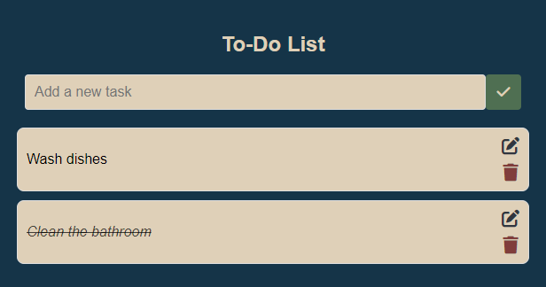

Here is a structured and comprehensive README for your "To-Do List" project.

---

# To-Do List Application 📝

This is a simple **To-Do List** web application built using **HTML**, **CSS**, and **JavaScript**. The app allows users to add, delete, and mark tasks as completed. It is responsive and provides a clean, user-friendly interface.



## Table of Contents 🔗
- [Features](#features)
- [Technologies](#technologies)
- [Getting Started](#getting-started)
- [Usage](#usage)
- [Responsiveness](#responsiveness)
- [Future Enhancements](#future-enhancements)
- [Contributing](#contributing)
- [License](#license)

## Features 🛠️

- Add tasks to the list.
- Delete tasks from the list.
- All tasks are saved on local-storage.
- Mark tasks as completed or uncompleted by clicking the task text.
- Responsive design for mobile and desktop.
- User-friendly interface with modern styling.

## Technologies ⚙️

- **HTML**: Structure of the web page.
- **CSS**: Styling and layout using Flexbox.
- **JavaScript**: Handles functionality like task addition, deletion, and task status management.

## Getting Started 🚀

### Prerequisites
You only need a web browser to run this project. It is built using plain HTML, CSS, and JavaScript, and does not require any external libraries or frameworks.

### Installation
1. **Download the project files**:
   Download or clone the repository to your local machine.

   ```bash
   git clone https://github.com/gustessari/to-do-list.git
   ```

2. **Open the `index.html` file**:
   Navigate to the folder where the project is stored and double-click the `index.html` file to open it in your browser.

No additional setup is required.

## Usage 🧑🏻‍💻

1. Open the **To-Do List** application in your browser.
2. Enter a task in the "Add a new task" input field.
3. Click the **Check** button or press **Enter** to add the task to the list.
4. To mark a task as completed, click on the task text.
5. To delete a task, click on the **Thrash Icon** next to the task.
6. To edit a task, click on the **Pencil Icon** next to the task.

## Responsiveness 📲

The app is designed to work on all screen sizes, from mobile devices to large desktops. The layout adjusts to the screen width using CSS media queries.

- **On small screens**: 
  - Input and buttons are resized to fit comfortably.
  - The task list remains readable, and the delete button stays aligned.

## Future Enhancements 📈

- ~~**Persistent storage**: Add localStorage functionality to save tasks even after the page is refreshed.~~
- ~~**Edit tasks**: Allow users to edit tasks after they've been added.~~
- **Animations**: Add animations when adding or removing tasks for a smoother user experience.
- **List categories**: Implement list categorization and filtering (e.g., work, personal).
- **Add new lists**: Allow users to add different lists.
## Contributing 🤜🏻🤛🏻

Contributions are welcome! Feel free to submit a pull request or open an issue if you have any suggestions or improvements.

### How to Contribute
1. Fork the repository.
2. Create a new branch for your feature or bug fix.
   ```bash
   git checkout -b feature-branch-name
   ```
3. Commit your changes.
   ```bash
   git commit -m "Add new feature or bug fix"
   ```
4. Push to your branch.
   ```bash
   git push origin feature-branch-name
   ```
5. Open a pull request.

## License 🪪

This project is open-source.

---
